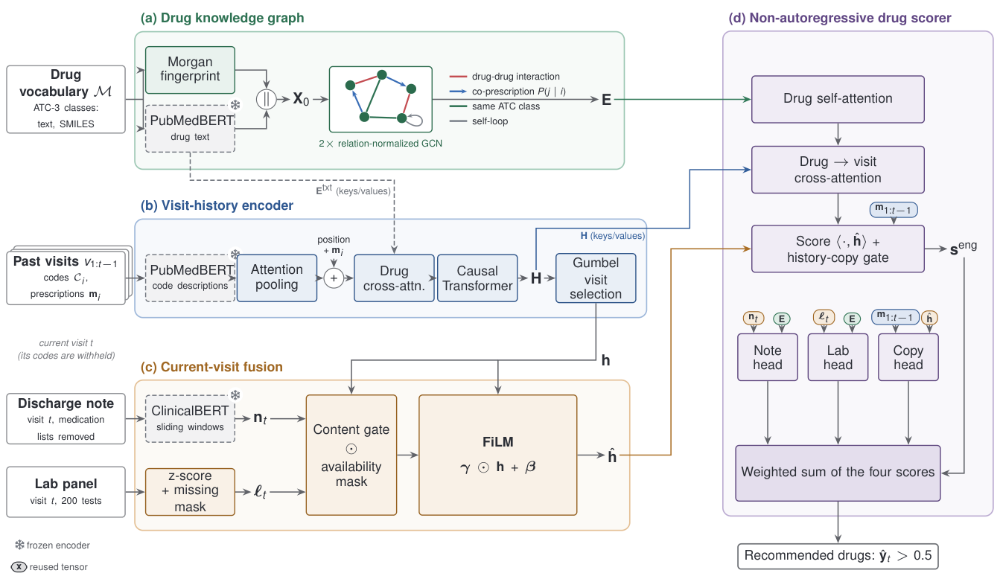

# MIRROR

Code for **MIRROR: Multimodal Integration for Drug Recommendation from Electronic
Health Records**.

MIRROR recommends the drug classes (ATC-3) for a hospital admission from the
patient's earlier admissions (diagnoses, procedures, prescriptions) and from the
discharge summary and laboratory values of the admission itself. The codes of
the admission being predicted are not used as input.



## Results

Test set, mean ± sample standard deviation over five seeds, DDI penalty
α = 0.2. NHJ<sub>new</sub> and NHJ<sub>dropped</sub> measure the overlap on the
drug classes started and stopped since the previous admission. The last column
is the Jaccard of repeating the previous admission's prescription.

| Cohort | Jaccard | F1 | PRAUC | DDI rate | NHJ<sub>new</sub> | NHJ<sub>dropped</sub> | Copy-forward |
|---|---|---|---|---|---|---|---|
| MIMIC-III | 0.5706 ± 0.0010 | 0.7190 ± 0.0008 | 0.8021 ± 0.0011 | 0.0656 ± 0.0009 | 0.2808 ± 0.0020 | 0.3365 ± 0.0046 | 0.4774 |
| MIMIC-IV, intensive care | 0.4664 ± 0.0006 | 0.6192 ± 0.0008 | 0.6960 ± 0.0019 | 0.0790 ± 0.0019 | 0.2786 ± 0.0031 | 0.4026 ± 0.0132 | 0.3474 |
| MIMIC-IV, hospital-wide | 0.5461 ± 0.0004 | 0.6911 ± 0.0004 | 0.7716 ± 0.0006 | 0.0992 ± 0.0009 | 0.2962 ± 0.0019 | 0.4499 ± 0.0031 | 0.4153 |
| MIMIC-IV, mixed ICD-9/10 | 0.5097 ± 0.0006 | 0.6576 ± 0.0005 | 0.7391 ± 0.0007 | 0.0928 ± 0.0014 | 0.3029 ± 0.0017 | 0.4651 ± 0.0062 | 0.3656 |

The result file of every reported run, including all ablations, is in
[results/](results). `python src/report.py results/` prints them as a table.

## Setup

Python 3.11 or newer. The reported runs used Python 3.12, PyTorch 2.1 and one
NVIDIA T4.

```bash
git clone https://github.com/Zied-Zaafrani/mirror-drug-rec.git
cd mirror-drug-rec
pip install -r requirements.txt
```

MIMIC-III and MIMIC-IV must be obtained from PhysioNet;
[data/README.md](data/README.md) lists the files and the two preparation steps.

## Usage

```bash
# 1. Build a cohort from the raw tables (once per cohort)
python src/preprocess.py --cohort mimic3 --mimic_dir /data/mimic-iii-1.4 --drug_reference_dir /data/drug-reference
python src/features.py   --cohort mimic3 --mimic_dir /data/mimic-iii-1.4 --drug_reference_dir /data/drug-reference --device cuda

# 2. Train and evaluate (writes results/mimic3/full/result_mimic3_full_seed42.json)
python src/train.py --cohort mimic3 --seed 42 --save_model model.pt

# 3. Summarise results, and see the recommendations by drug name
python src/report.py results/
python src/showcase.py --cohort mimic3 --weights model.pt
```

The cohorts are `mimic3`, `mimic4_icu`, `mimic4_hospital` and `mimic4_mixed`.
`--all_seeds` runs the five reported seeds. The ablations are the same command
with `--no_notes`, `--no_labs`, `--no_copy_head` or `--self_loops_only`, and
`--interaction_weight` sets the DDI penalty α. All other settings are in
[src/config.yaml](src/config.yaml).

`showcase.py` prints, for every drug class, how often the model recommended it
correctly or wrongly and how often it missed it on the test patients.
`--patients 6` prints six test admissions instead, each drug marked right, wrong
or missed.

## Reproducing the paper

[notebooks/](notebooks) holds one Kaggle notebook per cohort (the two largest
are split by seed to fit a 12-hour session) and one that combines their outputs
and compares them with the table above. Each notebook checks that the
train/validation/test partitions match the reported runs before training.

## Code

| File | Contents |
|---|---|
| `src/config.yaml` | model, training and cohort settings |
| `src/preprocess.py` | raw MIMIC tables to patient records and drug matrices |
| `src/features.py` | code, note and laboratory inputs |
| `src/dataset.py` | loading a cohort, the patient split, the model inputs, the drug graph |
| `src/model.py` | the network: visit-history encoder, FiLM fusion, drug graph encoder, drug scorer |
| `src/metrics.py` | Jaccard, F1, PRAUC, DDI rate, NHJ<sub>new</sub>, NHJ<sub>dropped</sub>, copy-forward baseline |
| `src/train.py` | training, model selection, test evaluation, result file |
| `src/report.py` | results table |
| `src/showcase.py` | recommendations on test patients by drug name |

## Citation

```bibtex
@article{zaafrani2026mirror,
  title  = {{MIRROR}: Multimodal Integration for Drug Recommendation from Electronic Health Records},
  author = {Zaafrani, Zied and Ben Sassi, Dhekra and Mokni, Raouia},
  year   = {2026}
}
```

## License

MIT, see [LICENSE](LICENSE). The MIMIC data are subject to the PhysioNet
Credentialed Health Data Use Agreement; no data or trained weights are included.
